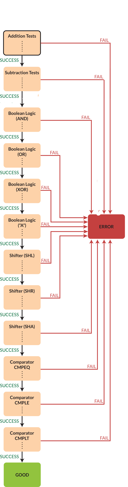

# 50002-FPGA-16bits-ALU
Implement 16-bit ALU design on an FPGA and test the functionality of the 16-bit ALU.
Testing is done by either manual testing or auto testing with FSM.

### Core ALU Functionality
* Addtion/Subtraction
* Boolean (AND, OR, XOR)
* Shift Left/Right (with optional sign extension)
* Comparison (equal, less than, or both)
## Additional Features
* NOR
* NEGATE
* NAND
### Manual Testing
To run the manual testing, power the FPGA board and wait for the seven segment display to show the word "REST". Adjust the wanted operation by changing the 6-bit ALUFN code represented by dips number 16 to 21 (0:5). 

Press the button on the top and wait until the display shows "STR1" which is for storing the first value. The FPGA will now wait for the input. Enter the 16-bit value for STR1 by switching dips number 0 to 15. Lit LED represents '1' and unlit LED represents '0'. 

Press the button on the bottom and wait until the display shows "STR2" which is for storing th second value. At the same time, this will confirm the input for STR1. Do the same for STR2 by switching dips number 0 to 15.

Press the button on the middle to calculate the values using the chosen operators.

If any mistake occurs, press the button on the left to reset the FPGA to its initial state (REST).

## Auto Testing
To run the automated testing you need to be at the REST state and just press the RIGHT button and wait for the display to show the word "AUTO".

The automated testing tests each operations 2 times in this order:

- Addition
- Subtraction
- And
- Or
- Xor
- Shift Left
- Shift Right
- Shift Right Assigned
- Compare equal to
- Compare less than
- Compare less than equal

This module uses a Finite State Machine (FSM) to iterate through a series of test cases for the variations operations the ALU should be capable of performing, testing some postive, negative, mixed and boundary cases.

The diagram below shows how the FSM works.

